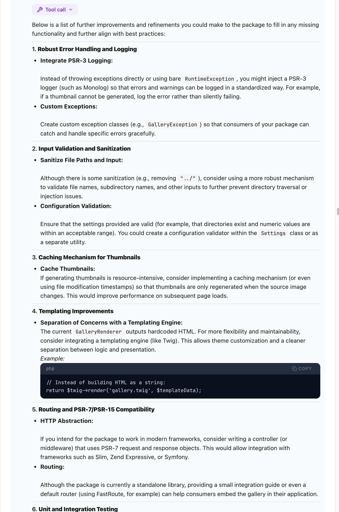

# Design Improvements for Frontend Formatting

## About
This document captures design improvements for frontend formatting as noted by the design team. At all times consider:
- **Readability** - The content should be easy to read and understand. This includes using clear and concise language, as well as using visual elements such as headings, bullet points, and whitespace to help guide the user's eye and make the content more scannable.
- **Consistency** - The formatting should be consistent throughout the application. This includes using the same fonts, font sizes, and colors for similar types of content, as well as using the same formatting for similar types of elements (e.g., buttons, links, etc.).
- **Accessibility** - The formatting should be accessible to all users, including those with disabilities. This includes using appropriate color contrast, providing alternative text for images, and ensuring that the content can be navigated using a keyboard or screen reader.
- **Responsiveness** - The formatting should be responsive and adapt to different screen sizes and devices. This includes using relative units for font sizes and spacing, as well as using flexible layouts and grids to ensure that the content is displayed properly on all devices.

**Think:** Great UX, and beautiful design!

## Notes

<box>
**Note:** This is a work in progress. The design team has not yet finalized the design.
</box>

## Design Improvements

### 1. Code Blocks

#### 1.1. Code block rendering
- Code blocks should be rendered with syntax highlighting and a copy button. Use syntax highlighting that is language aware / specific to improve readability and make it easier for users to understand the code. The copy button allows users to easily copy the code block content to their clipboard, which is a common feature in chat applications and improves the user experience (copy must be raw without the colour rendering.)
- increase the leading for monospace blocks to improve readability. This is especially important for code blocks, as it can help to visually separate lines of code and make it easier to read. The leading should be increased enough to create visual separation between lines, but not so much that it creates too much whitespace and makes it harder to read the content.

#### 1.2. Code block backgrounds
- Make a subtle shade lighter, currently too dark and creates too much contrast with the text, which can make it harder to read. The background should be light enough to create visual separation between the code block and the rest of the content, but not so light that it creates too much contrast with the text. A good starting point would be to use a background color that is a few shades lighter than the current background color. We can then adjust the color as needed based on user feedback and testing. The goal is to find a balance between creating visual separation and maintaining readability.

#### 1.3 Code block line numbers
- Add line numbers to code blocks to improve readability and make it easier for users to reference specific lines of code. This is a common feature in code editors and can be a useful addition to code blocks in chat applications. Line numbers should be displayed in a way that does not create visual noise or make it harder to read the code. They should be aligned to the left of the code block and should have a different color or style than the code itself to create visual separation. The line numbers should also be optional, allowing users to toggle them on or off based on their preferences.
- Line numbers should be aligned to the left of the code block and should have a different weight or colour or style than the code itself to create visual separation.
- The line numbers should be in a column that is visually separated from the code content, by a vertical line and a slight change in background shade. This helps to create a clear distinction between the line numbers and the code content, making it easier for users to read and reference specific lines of code.
- When user drags selection across a few lines, the line numbers should not be included in the selection. This is a common feature in code editors and can improve the user experience.
- Lines numbers should not be included in the copy button action. This is a common feature in code editors and can improve the user experience.

#### 1.4. Code block wrapping
- Code blocks should be wrapped to the width of the container, similar to most code editors. This allows users to view the entire code block without having to scroll horizontally, which can be a common issue with long lines of code. The code block should be wrapped in a way that maintains readability and does not create visual noise or make it harder to read the code. The wrapping should be based on the width of the container, allowing the code block to adjust to the size of the screen or window. This can be achieved using CSS properties such as `overflow-wrap` or `word-wrap`, which allow text to wrap within a container. The code block should also be scrollable vertically if it exceeds the height of the container, allowing users to view the entire code block if needed.
- Wrapping should not break the code formatting or indentation, as this can make it harder to read and understand the code. The wrapping should be done in a way that maintains the structure of the code, allowing users to easily read and understand the content.
- Wrapping is a visual change only, and should not affect any copy actions.
- Having a horizontal scrollbar is a failure of UX design for code blocks, and should be avoided at all costs. It creates a poor user experience and can make it difficult for users to read and understand the code. Wrapping the code block to the width of the container is a much better solution that improves readability and allows users to view the entire code block without having to scroll horizontally.

### 2. Tables

- Tables should be rendered as HTML tables with a copy button. 
- Backgrounds for table headers and rows should be added to improve readability.
- The spacing between table rows should be increased to improve readability.
- No vertical lines should be rendered in tables. This creates visual noise and makes it harder to read the content. Instead, use spacing and background colors to create visual separation between columns.
- Horizontal lines should be rendered between table rows to improve readability with the appropriate weight and color to distinguish headers from rows. This helps to visually separate the rows and makes it easier to read the content. The lines should not be too heavy or too light, as this can create visual noise and make it harder to read the content. 

### 3. Lists

- The spacing between list item heading and content should be reduced
- The padding after a list item should be increased to improve readability

See image for example of current issue: 

#### 3.4. Rule lines

- Only render rule lines when explicitly included in the markdown. Do not render rule lines between every message. This creates visual noise and makes it harder to read the conversation. Use spacing and padding to create visual separation between messages instead of rule lines.

### 4. Turn Blocks

- The end of each turn should have a copy button to copy the entire turn. This allows users to easily copy and share specific turns in the conversation. For now, we should copy the raw markdown content to the clipboard, but in the future we may want to copy the rendered content as well. This is a common feature in chat applications and will improve the user experience.
- There should also be a button to speak the content of the turn using text-to-speech. This allows users to listen to the conversation instead of reading it, which can be helpful for accessibility and for users who prefer audio content. This is good for accessibility and for users who prefer audio content.

### 5. Accessibility

- Research best practices for accessibility. This includes things like:
  - Color contrast
  - Font size
  - Screen reader support
  - Keyboard navigation
  - ARIA labels
  - Alt text for images
  - Content structure and semantics
  - Focus management

- This should still look good and be usable for all users, including those with disabilities. Accessibility is an important aspect of design and should be considered in all design decisions.

### 6. Dark Mode

- The design does support dark mode. However, this has not been designed yet and still has legacy design code that needs to be updated. 
- Dark mode should look like a natural extension of the light mode design. It should not look like a completely different design. This will make it easier for users to switch between light and dark mode and will create a more consistent user experience.

### 7. Very long user prompts

- For very long user prompts, we should consider truncating the content and adding a "Read more" button to expand the content. This will improve readability and make it easier for users to read the content without being overwhelmed by a large block of text. This is especially important for mobile devices where screen real estate is limited. Limited to user prompts only.


### 8. Search Bar

- Move the search bar to the sidebar navigation to improve accessibility and make it easier for users to find and use the search functionality. 
- The position  of the search in the side nav should be under the site title. 

### 9. Sidebar Navigation and Items

#### 9.1. Sidebar collapse
- The sidebar navigation should be collapsible to improve accessibility and make it easier for users to navigate the site. The sidebar should be collapsible in a way that does not create visual noise or make it harder to navigate the site. The collapse button should be easily accessible and should have a clear visual indication of its function.

#### 9.2. Tags

- Move this to within the navigation items and make it expandable/collapsible (but only if it has items). This will improve the organization of the sidebar and make it easier for users to find and use the tags functionality. The tags section should be collapsible in a way that does not create visual noise or make it harder to navigate the site. The collapse button should be easily accessible and should have a clear visual indication of its function.
- Tags formatting shall stay the same as it is for now.

#### 9.3. Sidebar layout

- The layout of the sidebar should similar to as follows. The exact items and order may vary, but the overall layout should be similar. If an item is included or missing on this example, it is not an indication of whether it should be included or missing in the final design. This is just an example of a possible layout for the sidebar navigation.

```
[TOP OF SIDEBAR]
- Site Title
[sidebar wide rule line here to separate from main content]
- Search Bar
- Tags (collapsible if it has items)
  - Small tag pills with tag name and count of conversations with that tag
-Favourites (collapsible if it has items)
  - reduces list of conversations to just those that are favourited, for easy access to important conversations
- List of Conversations Titles (with most recent at the top)
(pinned conversations at the top of the list, above recent conversations, if we include that feature)

[BOTTOM OF SIDEBAR PINNED TO BOTTOM - sidebar wide rule line here to separate from main content]
- Settings
- Import
- Help
```

### 10. Conversation List

- The conversation list should be scrollable and should not be affected by the height of the sidebar. 
- The items above the conversation list should be fixed in place and should not scroll with the conversation list.
- The items and the bottom of the sidebar should be fixed in place and should not scroll with the conversation list. 
- The list should be just the conversation titles, and should not include any additional information such as the last message or the date of the last message. This will improve readability and make it easier for users to find and select the conversation they want to view. The conversation titles should be displayed in a way that is easy to read and understand, such as using a larger font size or bold text.
- Hovering over a conversation should show hover effect and the conversation metadata (date).
- The list should have ordering options including accending/descending order.

When the interface is first loaded and no conversation is selected, the conversation area should be empty and have an icon and message inviting the user to select a conversation, search etc. (We do not offer starting a new conversation, as that is not the purpose of this app/site).

## Further Considerations

- Unless explicitly stated otherwise, no change of functionality is implied by any of the above design improvements. 
  *For example: adding a copy button to code blocks does not imply that the content of the code block will be changed in any way when copied. The copy button should copy the raw content of the code block without any formatting or changes. This is important to maintain the integrity of the code and ensure that it can be used as intended when copied.*

- The site logo and branding have not been finalised yet, so the design should be flexible enough to accommodate different branding and logo designs. The design should be able to adapt to different color schemes and styles without losing its overall aesthetic and usability.

- The design should be responsive and adapt to different screen sizes and devices, including desktops, laptops, tablets, and smartphones. This is already partially implemented in the current design, but may require further adjustments and improvements to ensure that the design looks good and functions well on all devices.

- We have not included any masthead, footers or other elements yet. But the design should be flexible enough to accommodate these elements in the future if needed. The design should be able to adapt to different layouts and structures without losing its overall aesthetic and usability.